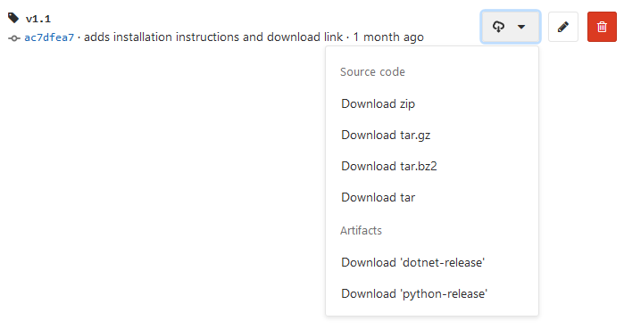

# Hagelkorn
This is a package for generating human-readable and human-memorable IDs.

Aside from random ID-generation from a reduced alphabet, IDs can also be generated such that they
are monotonically increasing with time.

## Usage

```python
import hagelkorn

# default settings sample about 17 million different IDs
hagelkorn.random()
> '4W8K6'

hagelkorn.monotonic()
> '1DFL5M'

# time-resolution of < 0.1 seconds
# overflowing after exactly 5 years
hagelkorn.monotonic(resolution=0.1, overflow_years=5)
> '2Y38H6C'
```

## Installation


1. Got to [Repository/Tags](https://gitlab.com/diginbio-fzj/hagelkorn/tags) to view the
   list of releases & their release notes.
2. Click the _download_ button on the right



### Python
Download the `python-release` artifact, unpack the `*.whl*  and install via pip:

```bash
pip install hagelkorn-x.x-py3-none-any.whl
```

### C#
Download the `dotnet-release` artifact, that contains the NuGet package.